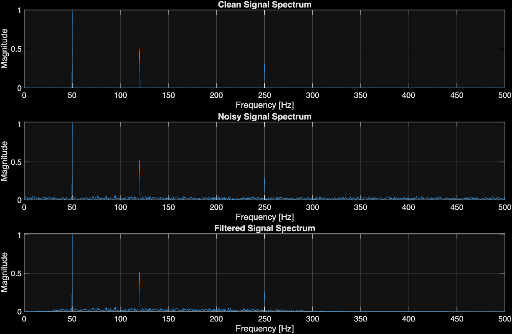
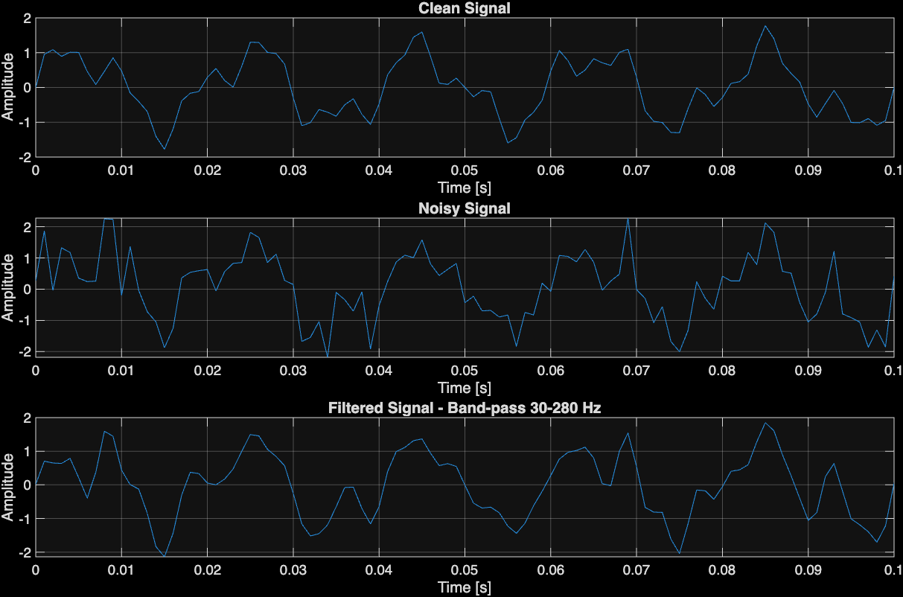

# MATLAB-Signal-Processing-Workbench
MATLAB project demonstrating generation, analysis, and filtering  of multi-frequency signals contaminated with Gaussian noise.
# MATLAB Signal Processing Workbench

A MATLAB signal-processing project demonstrating signal generation,
Gaussian noise modeling, FFT-based frequency analysis, digital filtering,
and quantitative evaluation of signal reconstruction.

## Features

- Generates multi-frequency sinusoidal signals
- Adds Gaussian random noise
- Performs FFT-based frequency-domain analysis
- Computes one-sided amplitude spectra
- Designs and applies a Butterworth band-pass filter
- Compares clean, noisy, and filtered signals
- Evaluates filtering performance using SNR and MSE

## Signal Processing Pipeline

Clean Signal
↓
Add Gaussian Noise
↓
FFT
↓
Frequency-Domain Analysis
↓
Butterworth Band-Pass Filter
↓
Filtered Signal
↓
SNR / MSE Evaluation

## Example Results

### Frequency-Domain Analysis

### Filtering Results

## Technologies

- MATLAB
- FFT / IFFT
- Digital Signal Processing
- Butterworth Filtering
- Gaussian Noise Modeling
- SNR
- Mean Squared Error (MSE)
